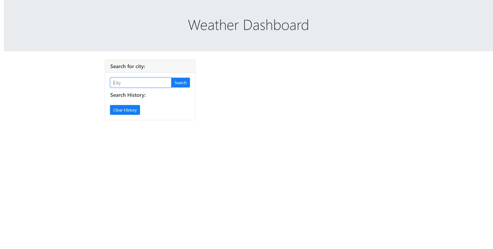
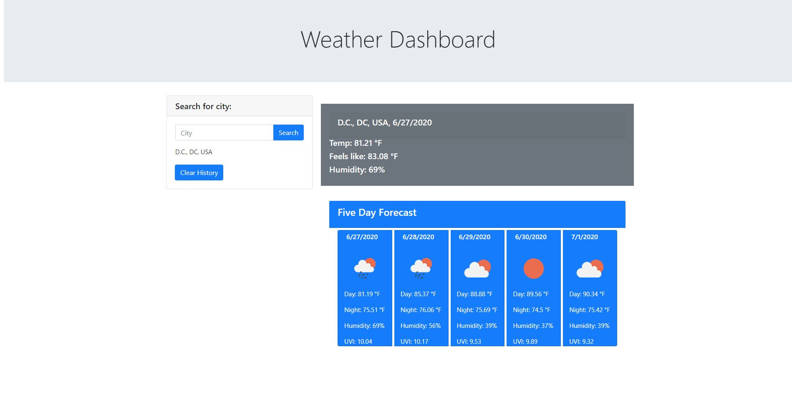

# weather-dashboard
- The application allows the user to input a city to find the current weather as well as a five day forecast
- when the user starts typing it shows suggestions in the input box
- everytime the user inputs city it get saved in the local storage and appended on search history, and when the user open the application again it loads the   information of the last location entered.
- If the user click clear history it will clear the cities list.

- Application link: https://kaylan83.github.io/weather-dashboard/

  